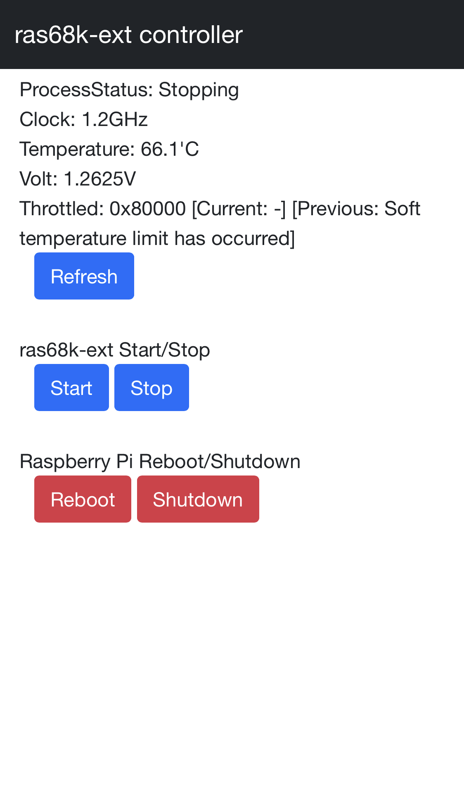
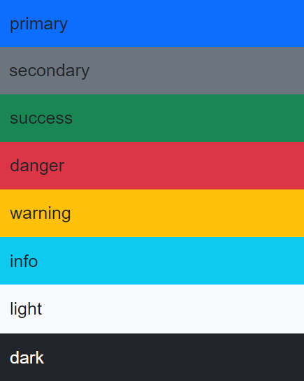

# proc-web-con
<p align="center">
  
  
  
</p>

Webブラウザよりプロセスの起動/停止、OSのリブート/シャットダウンを行います。   
設定ファイルを変更することで実行コマンドの変更や追加、表示文字列やボタンのスタイルの変更が可能です。   
主にRaspberry Piでの使用を想定していますが、他のOSでも使用可能かと思います。   

[<kbd></kbd>](./images/procwebcon_en.png)[<kbd></kbd>](./images/procwebcon_ja.png)

## インストール
### Node.jsのインストール
本ツールはNode.jsを使用します。32bit版Raspberry Piであれば、以下の手順でインストールします。   
(環境差分がある部分は適宜変更してください。)

1. https://nodejs.org/ja/download より、ARMv7のリンクを取得

2. /home/piにディレクトリを変更し、1.で取得したリンクを使ってwgetを実行
```
wget https://nodejs.org/dist/v18.17.0/node-v18.17.0-linux-armv7l.tar.xz
```
3. 2.で取得したファイルを展開
```
tar xvf node-v18.17.0-linux-armv7l.tar.xz
```
4. 3.で作成されたディレクトリに合わせて.bashrcでパスを追加
```
echo 'export PATH=$HOME/node-v18.17.0-linux-armv7l/bin:$PATH' >> ~/.bashrc
source ~/.bashrc
```

また、後の手順でnpmコマンドによる各ライブラリの取得がありますが、Raspberry Pi上ではリポジトリへのアクセスに失敗する可能性があります。その場合は、/etc/hostsに以下を追加してください。
```
104.16.20.35 registry.npmjs.org
```

### proc-web-conのインストール
以下のファイルを適当な場所に配置します。

* proc-web-con.js
* proc-web-con.ejs
* user_config.yaml
* user_config_ja.yaml
* user_config_simple.yaml
* package.json
* package-lock.json

以下のコマンドを実行し、必要なライブラリをインストールします。
```
npm ci
```
### サンプルの設定ファイル
設定ファイルのサンプルは3種類あります。全て[ras68k-ext](http://opmregisters.web.fc2.com/ras68k/)を対象としたサンプルとなっています。
| &nbsp;&nbsp;&nbsp;&nbsp;ファイル名&nbsp;&nbsp;&nbsp;&nbsp; | 内容 |
| ---- | ---- |
|  user_config.yaml  | 設定可能な全ての値を定義しています。ラベル名は英語にしています。また、user_config.yamlはツールのデフォルト設定ファイル名となります。   |
|  user_config_ja.yaml  |  user_config.yamlの日本語版です。  |
|  user_config_simple.yaml  | ツールでデフォルト指定が可能なものを除いたシンプルな設定ファイルです。最低限このファイルの設定値で動作可能です。   |

### 設定ファイルの編集
設定名から推測できるものは除いて、ポイントのみ説明をします。   

基本設定のtitleはブラウザのタイトルバーと、画面本体のタイトルに使用されます。   
titleStyleは画面本体のタイトルの表示スタイルの指定です。   
buttonStyleはプロセス確認の更新ボタン、及びコマンド定義されたボタンのスタイルの指定となります。
```
# 基本設定
title: 'ras68k-ext controller'
titleStyle: 'dark'
buttonStyle: 'primary'
listenPort: 3000
executingMessage: '実行中...'
```
使用可能なスタイルは以下となります。   
[](./images/style.png)

プロセス監視関連設定のprocessNameは稼働状況を監視したいプロセス名を指定します。grepコマンドに指定するものであるため、厳密にプロセス名と完全一致しなくても問題ありません。例では"pi68k-ext"とありますが、実際には"pi68k-ext_r2"または"pi68k-ext_r3"のプロセスの稼働を確認します。   
monitoringCmdの指定があった場合は、任意のコマンドの実行結果をプロセスの稼働確認と同時に表示することが出来ます。

```
# プロセス監視関連設定
processName: 'pi68k-ext'
processRunningMessage: 'プロセス状況: 起動中'
processStoppingMessage: 'プロセス状況: 停止中'
refreshButtonName: '更新'
monitoringCmd: 'sudo /home/pi/proc-web-con/rasp_stat_ja.sh'
```

OS 再起動/シャットダウン関連設定のosRebootShutdownButtonStyleは再起動、シャットダウンボタンのスタイルの指定です。   
rebootCmd、shutdownCmdで実行するコマンド名が指定可能です。   
rebootConfirmMessage、shutdownConfirmMessageは実行前に確認するダイアログに表示する文字列です。

```
# OS 再起動/シャットダウン関連設定
osRebootShutdownTitle: 'Raspberry Pi 再起動/シャットダウン'
osRebootShutdownButtonStyle: 'danger'
rebootCmd: 'sudo reboot'
rebootButtonName: '再起動'
rebootConfirmMessage: '再起動しますか？'
shutdownCmd: 'sudo shutdown -h now'
shutdownButtonName: 'シャットダウン'
shutdownConfirmMessage: 'シャットダウンしますか？'
```

コマンド定義ではcommands配下に実行したいコマンド内容とボタン名を複数指定可能です。   
nameがボタン名、cmdが実行コマンド、dirがコマンド実行ディレクトリ、timeoutはタイムアウト時間(ms)の指定です。

```
# コマンド定義
commandsTitle: 'ras68k-ext 起動/停止'
commands:
  - name: '起動'
    cmd: 'sudo /home/pi/pcmd/pi68k.py start'
    dir: '/home/pi/pcmd'
    timeout: 5000
  - name: '停止'
    cmd: 'sudo /home/pi/pcmd/pi68k.py stop'
    dir: '/home/pi/pcmd'
    timeout: 30000
```

## 使用方法
以下のコマンドで起動可能です。オプション指定がない場合は、設定ファイルはuser_config.yamlが使用されます。
```
node proc-web-con.js
```
実行後、以下が表示されればブラウザからアクセス可能です。   
Raspberry Piに割り当てられたIPアドレス、またはlocalhostに対してポート番号を付与してアクセスしてください。
```
Server started. ListenPort: 3000
```

設定ファイルを指定したい場合は-cオプションを使用します。
```
node proc-web-con.js -c user_config_ja.yaml
```

## 自動起動設定
systemdを使用し、OS起動時にproc-web-conを自動起動するようにします。   
proc-web-con.serviceのデフォルトの状態は以下となっています。   
```
[Unit]
Description=Process controller from web browser

[Service]
WorkingDirectory=/home/pi/proc-web-con
ExecStart=nohup /home/pi/node-v18.17.0-linux-armv7l/bin/node proc-web-con.js -c user_config_ja.yaml >/dev/null 2>&1 &

[Install]
WantedBy=multi-user.target
```
proc-web-con.jsの配置先が「/home/pi/proc-web-con」と異なる場合は、WorkingDirectoryの修正をしてください。   
また、Node.jsのインストール先が「/home/pi/node-v18.17.0-linux-armv7l/bin」と異なる場合や、使用する設定ファイルを変更したい場合は、ExecStartを修正してください。   

proc-web-con.serviceの内容が問題なければ、以下を実行することで、起動時にproc-web-con.jsが自動起動されます。
```
sudo cp proc-web-con.service /etc/systemd/system
sudo systemctl enable proc-web-con.service
```

## ライセンス
proc-web-conはMITライセンスを適用しています。

